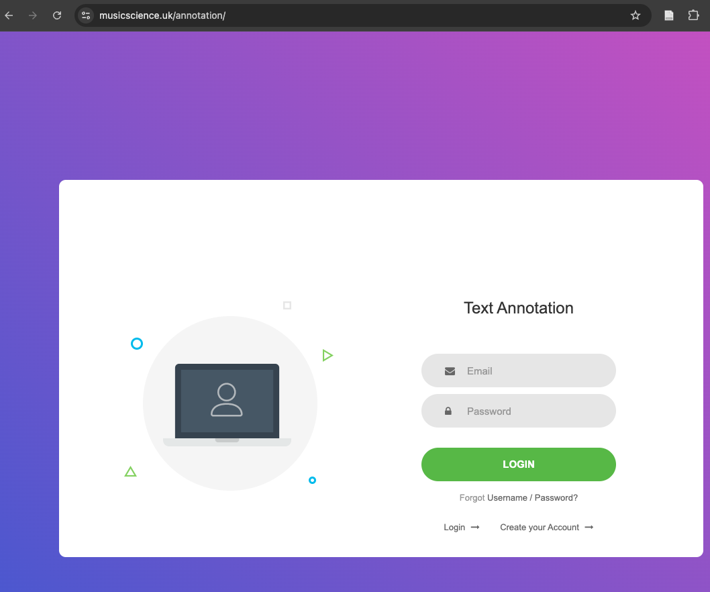
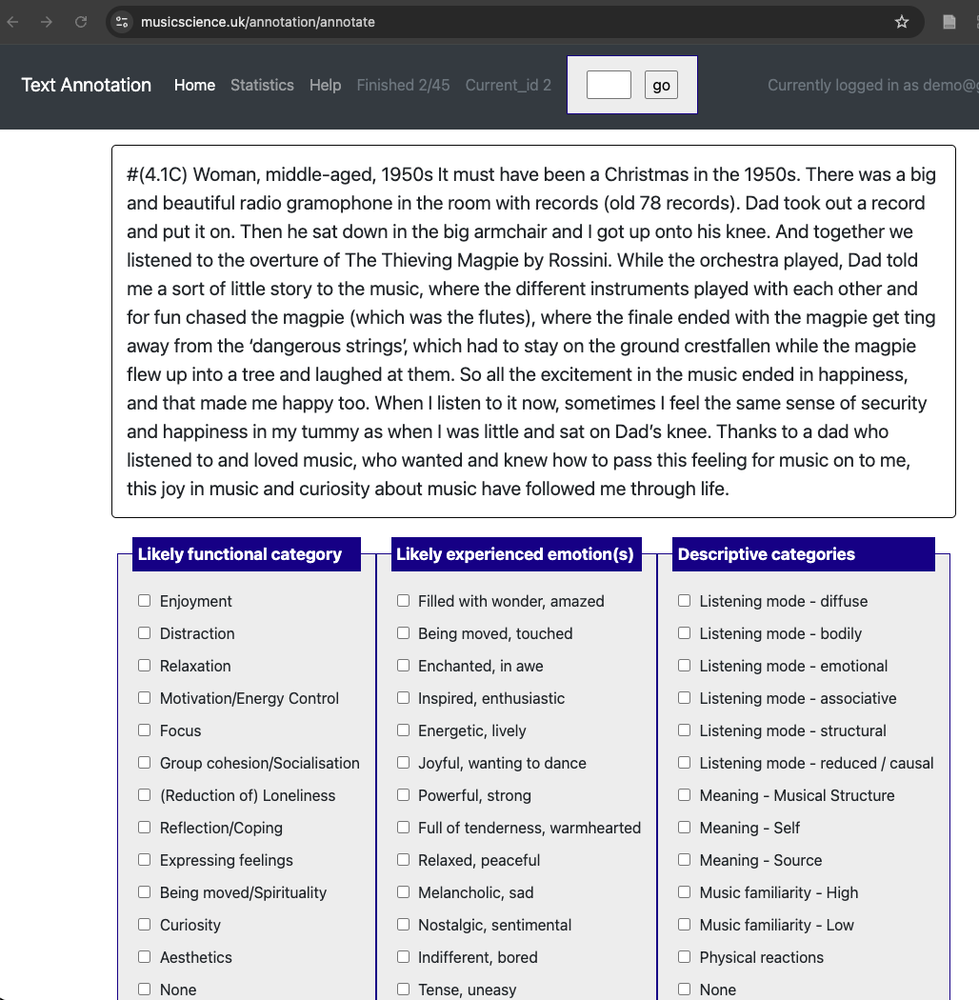

# annotation

> [!NOTE]
> This repository contains instructions to carry out annotations using a separate web server. This is a work-in-progress and created to facilitate research on music and emotions.

## Task: Annotate emotion experiences

This annotation task is about classifying existing texts about strong experiences with music. Annotation means that you (or anyone) reads a text and uses an annotation scheme to mark specific categories that fit the text. The first batch is 100 texts to try out this operation.

## Texts

The first 12 texts are short descriptions are so-called "vignettes" that have been created to the test the functional categories in another study. They are very short, and do not have much details, but they should be clear what functional category they represent.

The actual texts are from _Strong Experiences With Music_ book by Alf Gabrielsson (2010). This book contains about 1,000 descriptions of strong experiences of music by Swedish citizens. Some of the experiences are from 1950, 1960s, as the participants remember the times in their life when they have encountered music that made a strong experience for them. It is actually quite fun to read some of these experiences. 

> [!WARNING]
> There might be some wrong line breaks, editors notes, and sub-headings in the middle of the text since these have been automatically extracted from the book. Ignore anything clear typographical errors or scanning mistakes.

## Task

Your task is to read each short text clip and determine what is the best description of the experience using **three annotation schemes**. These are:

1. _functional category of the experience_,
2. _emotion_
3. _descriptive scheme_. 

It might be that these do not quite capture the experience, and sometimes the text will fit into several categories, but you should be choose one episode from the text and choose the best fitting options from each category. Depending on the annotation scheme, you are also allowed to choose several categories. In each case, there is the option to answer also "None" if nothing fits.

### 1. Functional category

This category represents functional uses of music and the experiences that are common in different situations. This scheme is based on our _Episode model_ (Eerola, Kirts, Saarikallio, 2025) that characterises such situations in a broad manner. We have quite a lot of data about it, but we have never applied the framework to this kind of, exceptional material. It would be useful to mark the primary category (just a single) even though the same experience might fit several functional categories. If you are really torn between several, you can mark several, but usually try to contain the episode into one main function if at all possible.

- **Enjoyment**: Music is used for enjoyment, entertainment, for having a good time, fun
- **Distraction**: Music used to get away from worries and stressors, mediate boredom
- **Relaxation**: Music used to calm down, decompress, achieve low arousal state
- **Energy control**: Music used to control levels of intensity or drive, pumping up, motivation, stimulation
- **Focus**: Music used to maintain or enhance a mood, organise self or group coordination to a task
- **Group cohesion/socialisation**: Music used to facilitate connection, bonding, express joint identity or values, show commitment to a group
- **Reducing loneliness**: Music used to mediate loneliness, become a part of something, as a tool to dispel feelings of isolation
- **Reflection/Coping**: Music used to remember or to associate to other objects, provide sense of comfort, processing experiences
- **Expressing feelings**: Music used to release or communicate emotions, gain emotional insight, deal with a situation
- **Being moved/spirituality**: Music used to connect to a higher ideal or abstract feeling of non-social connection, religious activity, feeling or seeking strong emotions
- **Curiosity**: Music used to prompt new experiences, drive or attraction toward stimuli
- **Aesthetics**: Music used to achieve or create a desired ambience, fit to the “mood”, beauty
- **Other**: Something else or nothing fits

There might be of course several categories of experiences that could match the contents of text, but here the purpose is just to choose one that feels the best match.

### 2. Emotion

There are 14 descriptors of emotions taken from an existing scale called GEMIAC (Coutinho & Scherer, 2017). Choose one or more of these categories. Note that the list of 14 different emotion categories do not always give many emotion adjectives, but every category stands for other similar emotion terms (synonyms) as well. For instance, "happy" or "happiness" is not in the list, but this is a synonym of "joyful, wanting to dance" in their scheme. Similarly, if someone would be expressing in the text that they feel "depressed", the closest match is "melancholic, sad" in this scheme. So every time you think of the emotion listed, think of the type of emotions more broadly than just those two words used to label the category. It is possible to tick several of these boxes for one experience, of course.

- Filled with wonder, amazed
- Being moved, touched
- Enchanted, in awe
- Inspired, enthusiastic
- Energetic, lively
- Joyful, wanting to dance
- Powerful, strong
- Full of tenderness, warmhearted
- Relaxed, peaceful
- Melancholic, sad
- Nostalgic, sentimental
- Indifferent, bored
- Tense, uneasy
- Agitated, aggressive

> [!NOTE]
> If this helps the task, I could provide a larger synonym list for each emotion category.

### 3. Descriptive schemes

The last category of annotations contains actually **four different sub-categories**, one about how much _attention_ the listener is paying to music (we call this "Listening mode"). Usually there can be only one listening mode at the time. The listening modes are defined below.

- **Listening mode - diffuse**: Little to no attention directed at the music, choice of focusing on objects other than music
- **Listening mode - bodily**: Potential embodied motor processes are attuned to the music, agency (or lack thereof) over body response toward music
- **Listening mode - emotional**: Reflects attention directed toward the intensity of emotional experiences one could have with music, level of control over emotions experienced
- **Listening mode - associative**: Ideas, thoughts, and images prompted by the music, control over music to guide experience
- **Listening mode - structural**: Listening emphasis on processing musical content; understanding structure, themes, syntax, or patterns of sound.
- **Listening mode - reduced / causal**: Careful, forensic analysis of sound done with a reflective mindset

The second sub-category is _Musical Meaning_ and whether it is generated by the musical structure, self, or source, again, these are explained below. It is possible that all of them contribute to the experience.

- **Meaning - Musical Structure**: Imbued meaning associated to musical elements that are consciously important (instruments, sounds, lyrics, timbre, etc.)
- **Meaning - Self**: Personal memories (couples songs, associations to people, locations, events), self expression
- **Meaning - Source**: Sociopolitical context, historical conditions, musicians’ personae, performative interpretations

There are two statements about the episode, namely one about _familiarity_ with music (is it highly familiar) and another one about whether the music not at all familiar.

- **Music familiarity - High**: If they mention music being really familiar
- **Music familiarity - Low**: If they mention that they really do not know the music or it is unfamiliar, foreign, new.

The final category to tick is whether the person is describing any _physical reactions_, and they may be goosebumbs, shivers down the spine, tingling, knot in the stomach, feeling as if taken into the air, sweating, feeling sick, feeling the hairs in one's skin to rise and so on.

- **Physical reactions**: Conscious acknowledgement of physiological sensations, or physical pleasure (sensory pleasure/displeasure)

- None

> [!TIP]
> Experiences related to music can be much complicated and nuanced that what these schemes and the categories attempt to characterise. Nevertheless, this is an attempt to get information about the experience in a systematic and theory-driven fashion, which we have applied to other contexts as well.

# Interface

I've created a website which uses an annotation interface called "potato" (runs in Python). You need to create an account to it when you arrive to the landing page (username with your email and any password you want to use, this will be known only to you:

https://musicscience.uk/annotation/

Once you have created an account, you can log in to the system, and there is an interface for you, which looks like figure 2. You can use any address for this and it is not checked by email verification, so anything goes. The account will keep the annotations separately from the other annotators.

Here you can see a long text clip, and the three annotation schemes below. You should keep the guidance near at hand to learn what these categories actually mean. I'll try to have other persons to do the same task so we can compare the consistency across the annotators.

# References

- Coutinho, E., & Scherer, K. R. (2017). Introducing the Geneva Music-Induced Affect Checklist (GEMIAC): A brief instrument for the rapid assessment of musically induced emotions. _Music Perception, 34(4)_, 371–386. https://doi.org/10.1525/mp.2017.34.4.371
- Eerola, T., Kirts, C., & Saarikallio, S. H. (2025). Episode model: The functional approach to emotional experiences of music. _Psychology of Music, 53(4)_, 590-615. 
- Gabrielsson, A. (2011). _Strong experiences with music: Music is much more than just music_. Oxford University Press.
- Kirts, C., Saarikallio, S., Anderson, C. J., Bannister, S., Céspedes-Guevara, J., Heng, G. J., Henry, N., Jakubowski, K., Koehler, F., Krause, A. E., Lennie, T. M., Martínez, I. C., O'Neill, K., Warrenburg, L., & Eerola, T. (2026). Measuring Emotional Experiences with Music -- Content Validity Assessment for Episode Model Constructs. _Music & Science, 9_, [https://doi.org/10.1177/20592043251413550](https://doi.org/10.1177/20592043251413550). 

